# Written Analysis of the Election Audit

## ***Overview of Election Audit***

### **Purpose**
<!--Explain the purpose of this election audit analysis.-->

Provide a written analysis of the election audit for the election commission, which will include results of total votes, votes per candidate/county and percentages outcomes of the election. Taking in mind the importance of this critical data, the results are being shown clear and transparently for the comission, so in the near future they can transfer this information to the candidates, and most important to the voters.

 

## ***Election-Audit Results***
<!--Using a bulleted list, address the following election outcomes. Use images or examples of your code as support where necessary.-->
(*) *The next image is the summary of the extracted results, and will be sectionated in the next bullets for a better explanation of each outcome.*

<table>
    <tr>
        <td>&nbsp;&nbsp;&nbsp;&nbsp;&nbsp;&nbsp;&nbsp;&nbsp;&nbsp;&nbsp;&nbsp;&nbsp;&nbsp;&nbsp;&nbsp;&nbsp;&nbsp;&nbsp;&nbsp;&nbsp;&nbsp;&nbsp;&nbsp;&nbsp;&nbsp;&nbsp;&nbsp;&nbsp;&nbsp;&nbsp;&nbsp;&nbsp;&nbsp;&nbsp;&nbsp;&nbsp;&nbsp;&nbsp;&nbsp;&nbsp;&nbsp;&nbsp;&nbsp;&nbsp;&nbsp;&nbsp;&nbsp;&nbsp;&nbsp;&nbsp;&nbsp;&nbsp;&nbsp;&nbsp;&nbsp;&nbsp;</td>
        <td>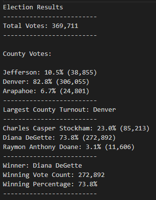</td>
    </tr>
</table>

### **How many votes were cast in this congressional election?**

<table>
    <tr>
        <td>Total Votes</td>
        <td>&nbsp;&nbsp;</td>
        <td>Total Votes - Code</td>
    </tr>
    <tr>
        <td>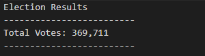</td>
        <td>&nbsp;&nbsp;&nbsp;&nbsp;&nbsp;&nbsp;&nbsp;&nbsp;&nbsp;&nbsp;&nbsp;&nbsp;&nbsp;&nbsp;&nbsp;&nbsp;&nbsp;&nbsp;&nbsp;&nbsp;&nbsp;&nbsp;&nbsp;&nbsp;&nbsp;&nbsp;&nbsp;</td>
        <td>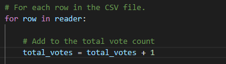</td>
    </tr>
</table>

    In here we can observe the Total Votes of all counties and all candidates, the sum of all votes was 369,711. This means that approximately 370k people of the total population of the three counties voted.

### **Provide a breakdown of the number of votes and the percentage of total votes for each county in the precinct.**

<table>
    <tr>
        <td>County Votes and Percentages</td>
        <td>&nbsp;&nbsp;</td>
        <td>County Votes and Percentages - Code</td>
    </tr>
    <tr>
        <td>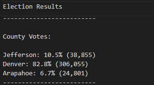</td>
        <td>&nbsp;&nbsp;&nbsp;&nbsp;&nbsp;&nbsp;&nbsp;&nbsp;&nbsp;&nbsp;&nbsp;&nbsp;&nbsp;</td>
        <td>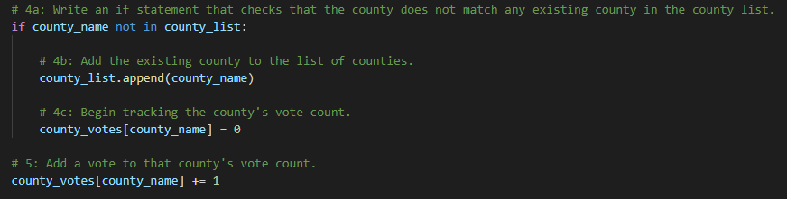 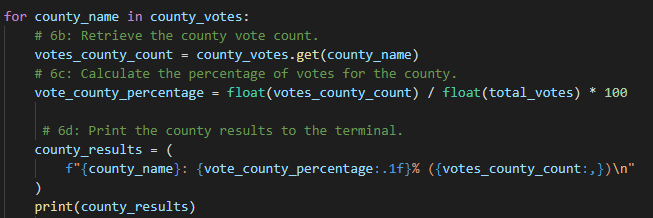</td>
    </tr>
</table>

    As we can see the three counties involved at this election were: "Arapahoe", "Denver", and "Jefferson". We can infer that Denver is the biggest county of the three involved, or at least with a bigger population than the other two, and that's why the we can say for every 1 vote of Arapahoe and Jefferson, there was 8 votes in Denver.

### **Which county had the largest number of votes?**

<table>
    <tr>
        <td>Largest County Turnout</td>
        <td>&nbsp;&nbsp;</td>
        <td>Largest County Turnout - Code</td>
    </tr>
    <tr>
        <td>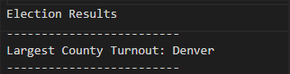</td>
        <td>&nbsp;&nbsp;&nbsp;&nbsp;&nbsp;&nbsp;&nbsp;&nbsp;&nbsp;&nbsp;&nbsp;&nbsp;&nbsp;&nbsp;&nbsp;&nbsp;&nbsp;&nbsp;&nbsp;&nbsp;&nbsp;&nbsp;&nbsp;</td>
        <td>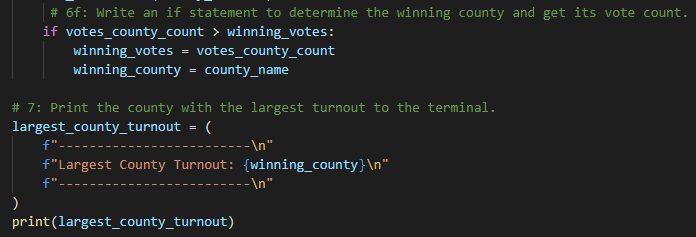</td>
    </tr>
</table>

    In scope of the last breakdown, we can see that there was a huge difference between votes of the three counties. With 306,055 votes, Denver was the one with the biggest percentage of involvement (82.8%).

### **Provide a breakdown of the number of votes and the percentage of the total votes each candidate received.**

<table>
    <tr>
        <td>Candidate Votes and Percentages</td>
        <td>&nbsp;&nbsp;</td>
        <td>Candidate Votes and Percentages - Code</td>
    </tr>
    <tr>
        <td>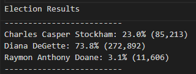</td>
        <td>&nbsp;&nbsp;&nbsp;&nbsp;&nbsp;&nbsp;&nbsp;&nbsp;&nbsp;&nbsp;&nbsp;&nbsp;&nbsp;</td>
        <td>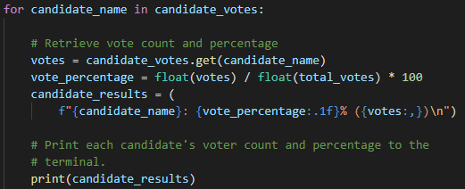</td>
    </tr>
</table>

    In terms of the candidates, there were three aspirants of winning this election, which as we can see there was no close election. The winner got an equivalent of 3 votes vs. 1 vote, this one vote is reflected in a sum of the two other candidates (Charles Casper Stockham - 85,213; Raymon Anthony Doan - 11,606). The percentages clearly show that the "real" competition was between two candidates, because the aspirant Raymond Anthony Doan did not even reach 5% of the votes.

### **Which candidate won the election, what was their vote count, and what was their percentage of the total votes?**

<table>
    <tr>
        <td>Winner Results</td>
        <td>&nbsp;&nbsp;</td>
        <td>Winner Results - Code</td>
    </tr>
    <tr>
        <td>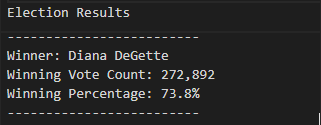</td>
        <td>&nbsp;&nbsp;&nbsp;&nbsp;&nbsp;&nbsp;&nbsp;&nbsp;&nbsp;&nbsp;&nbsp;&nbsp;&nbsp;</td>
        <td>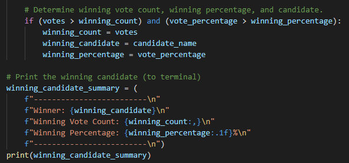</td>
    </tr>
</table>

    Finally, as an overview of the winner, we know that Diana DeGette won with a vote count of 272,892 of the total votes, that in terms of percentage was a 73.8%.

 

## ***Election-Audit Summary***
<!--In a summary statement, provide a business proposal to the election commission on how this script can be used—with some modifications—for any election. Give at least two examples of how this script can be modified to be used-->

As this code was based on a 'pseudocode', and tuned up with precise comments of each phase to the implemented code, this will help the next election comission to apply for future elections of the same category (counties in the same state), or could be local elections, or even could reach the presidential elections.
But in order to use this script for future elections we might need some modifications, and here are ones we suggest:
- Taking in mind that in the future we are in charge of this same analysis, we might not need the "os path" to retrieve the CSV document, so we can use a direct path.
- The 'variable's names'  might need to change if we use the script for local or other elections. In this case, we focused most of the variables names for the 'counties'.
- We could add to the script to print the position and the year of the election involved, but we will need to add 'input' data to the code. This also will be reflected at the txt.file.